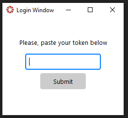
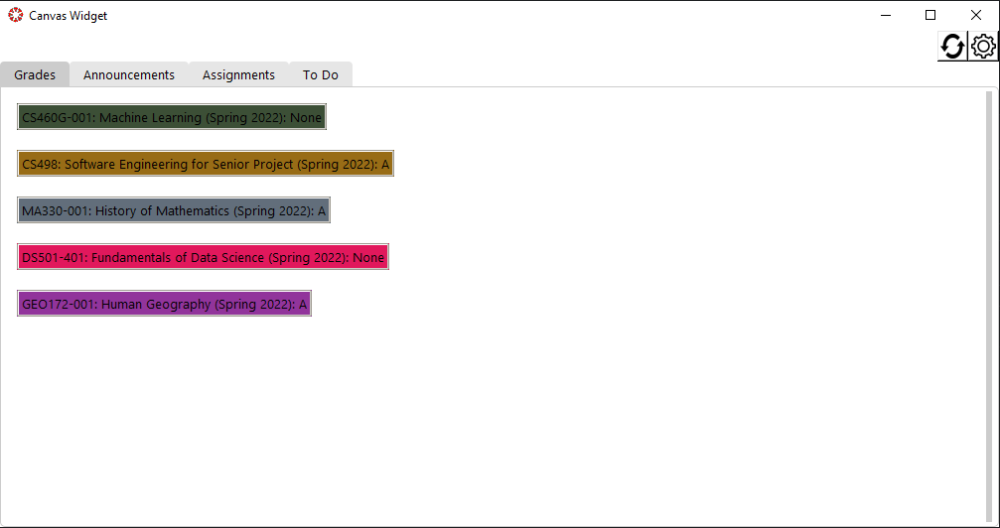
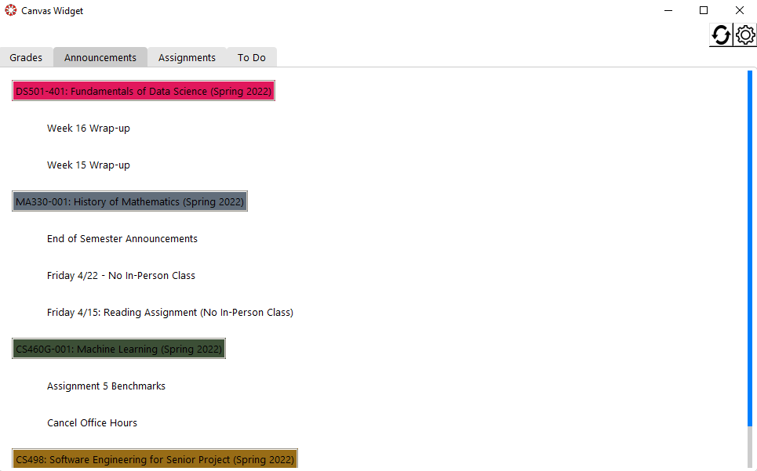
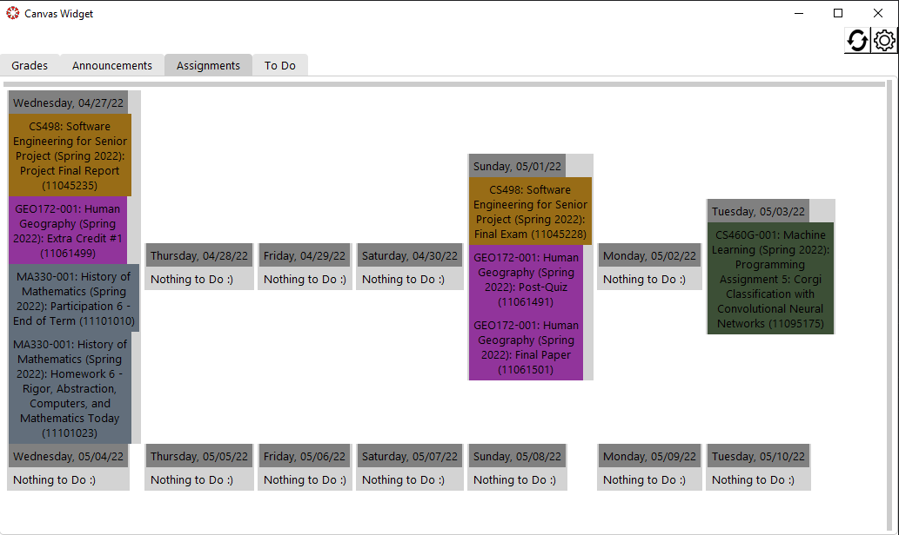
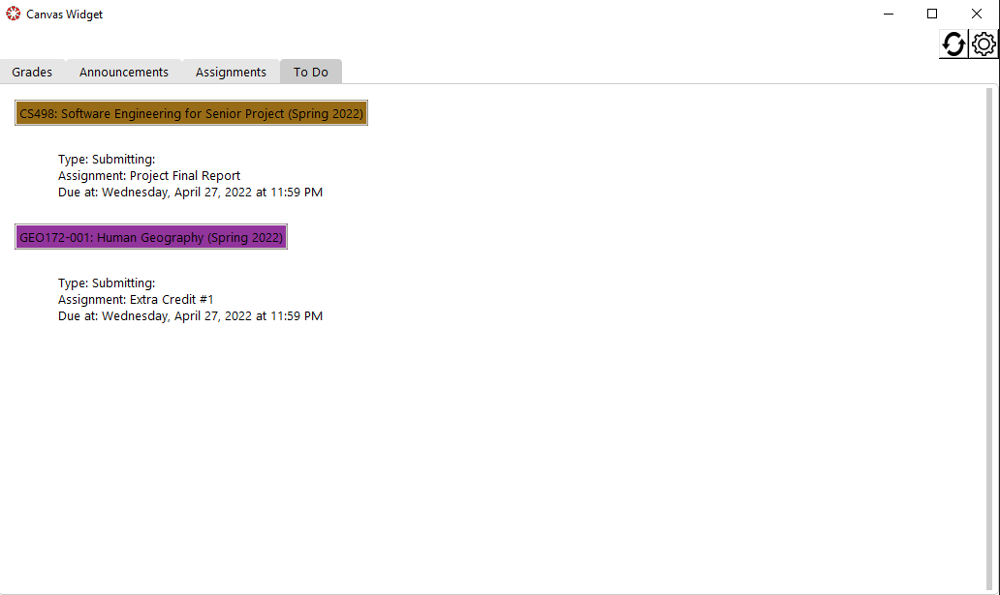
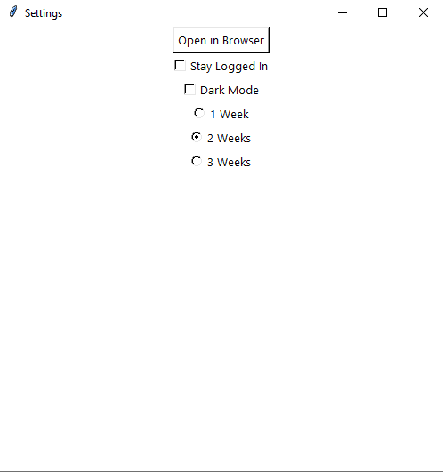
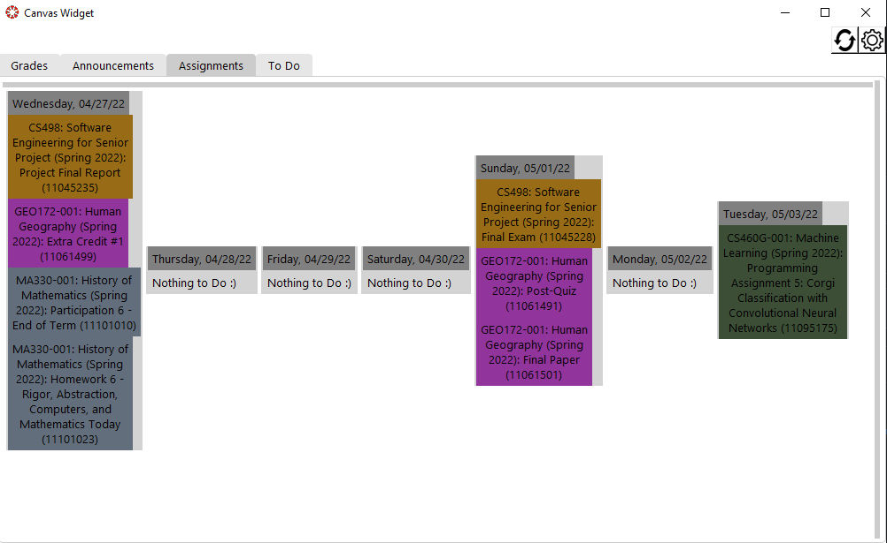
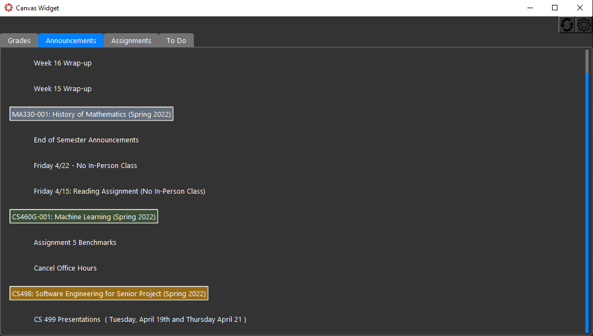

# Canvas-Widget
CS498 Project

Type 'python driver.py' in your terminal with the appropriate modules downloaded to start the application.

## Login

## Grades

## Announcements

## Assignments/Calendar

## To Do

## Settings Menu

## Calendar w/ 1 Week

## Dark Mode

